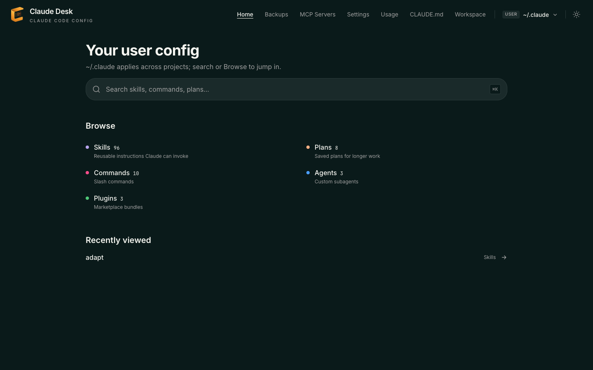
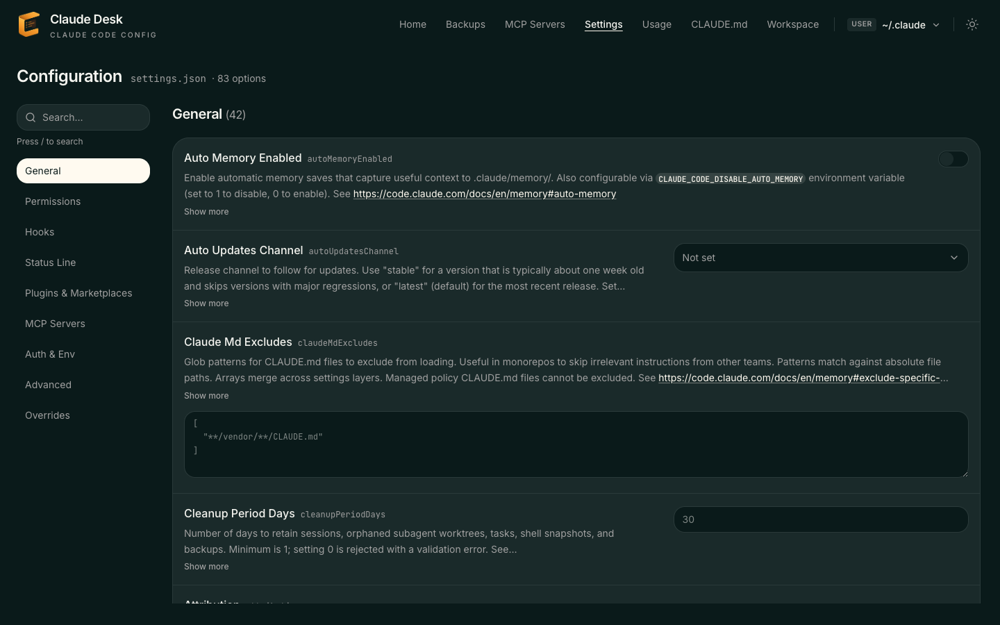
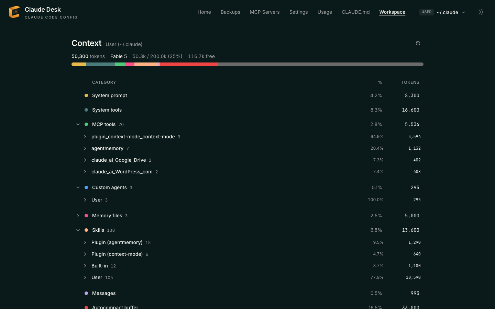
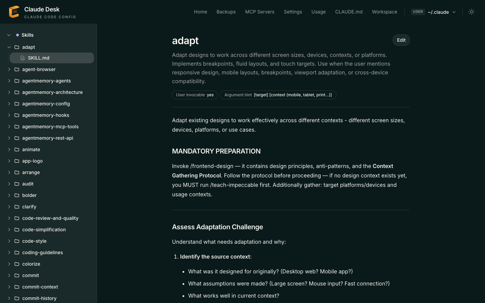
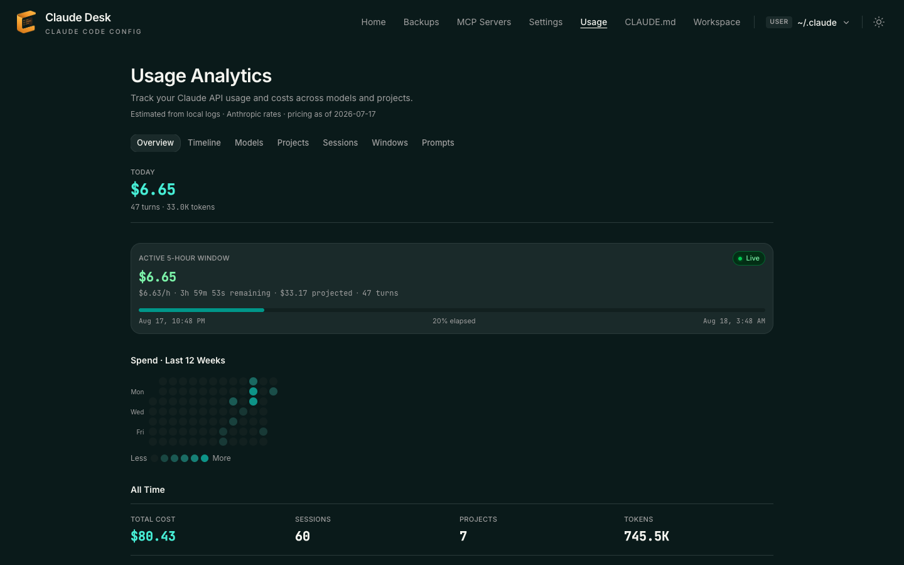
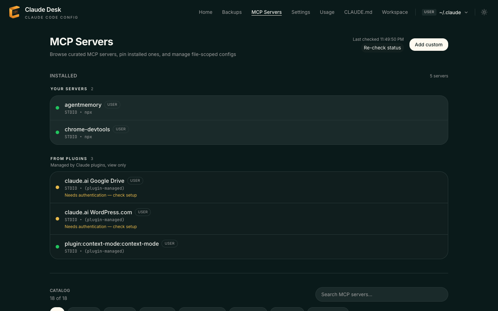

<div align="center">


# Claude Desk

Browse and edit your [Claude Code](https://docs.claude.com/en/docs/claude-code) config (`~/.claude`) in the browser — skills, plans, commands, agents, plugins, MCP, usage, backups, `CLAUDE.md`, and settings — without hand-editing JSON in the terminal.


[](https://github.com/deepakkumardewani/cc-studio/actions/workflows/ci.yml)
[](./LICENSE)

```bash
npx claude-desk
```

One command starts a localhost server and opens the UI. Close the tab to shut down (or pass `--keep-alive`).

[Why](#why) · [Features](#features) · [What's inside](#whats-inside) · [Quick start](#quick-start) · [Usage](#usage) · [Development](#development) · [Contributing](#contributing) · [How it works](#how-it-works) · [Privacy](#privacy--security)

</div>

---

## Why

Claude Code config lives as files under `~/.claude` — skills, plans, commands, agents, plugins, `CLAUDE.md`, and `settings.json`. Editing that stack in the terminal means bouncing between folders, raw JSON, and markdown with no single place to see what you have.

Claude Desk gives you a local browser UI for the same config: search it, read it with proper rendering, edit it safely, and inspect how context stacks up — without accounts, cloud sync, or leaving localhost.

## Features

- **User / project scope** — switch between `~/.claude` and a project’s `.claude` from the header
- **Workspace browser** — navigate skills, plans, commands, agents, plugins, `CLAUDE.md`, and settings from a single local UI
- **MCP servers** — catalog of installed servers plus custom stdio/HTTP servers and env vars, without hand-writing JSON
- **Usage** — local Claude Code transcripts with estimated spend; tabs Overview, Timeline, Models, Projects, Sessions, Windows, and Prompts
- **Backups** — list and restore config file backups
- **Readable markdown** — GFM rendering with syntax-highlighted code blocks (Shiki) for skills, plans, commands, and agents
- **Inline editing** — edit markdown files and save back to disk; unsaved-change protection when leaving a dirty page
- **Schema-driven settings** — edit `settings.json` through a typed form (dropdowns, toggles, env vars, plugins, marketplaces) instead of raw JSON
- **Context inspector** — see how context / usage stacks up across your workspace
- **Search** — filter your workspace quickly from the home view
- **Deep links** — open a file via scoped URL (`/user/skills/:name`, `/project/:projectId/...`)
- **Theme toggle** — light / dark UI
- **Safe by default** — API only reaches curated paths under `~/.claude` and the active project’s `.claude` (no arbitrary filesystem access); settings writes are still Zod-validated before save

## What's inside

**Home** — search user or project config, jump into categories, and reopen recently viewed files. Scope switcher is in the header.



**Settings** — schema-driven form for `settings.json` with searchable grouped sections.



**Workspace** — context inspector with per-category token breakdown.



**Skills** — file-tree sidebar plus markdown preview/editor for skills, plans, commands, and agents.



**Usage** — analytics from local transcripts: overview, timeline, models, projects, sessions, spend windows, and prompts.



**MCP servers** — installed servers for the active scope, plus a catalog to add stdio or HTTP servers.



## Quick start

**Requirements:** Node.js `>= 22.12` (or [Bun](https://bun.sh)). The Claude Code CLI is optional for browsing config.

```bash
npx claude-desk
# or
bunx claude-desk
```

The app binds to localhost, opens your browser, and serves the prebuilt UI. No account, no cloud, no telemetry.

> [!TIP]
> Use `--keep-alive` if you want the server to stay up after closing the browser tab (handy while iterating on skills or settings).

## Usage

```
claude-desk [options]

Options:
  -p, --port <n>    Listen port (default: random)
  --keep-alive      Keep the server running after the browser tab closes
```

The listen URL includes `#token=...` for local API auth.

Examples:

```bash
npx claude-desk --port 4000
npx claude-desk --keep-alive
```

### What you can open

| Area        | Where it lives                                             |
| ----------- | ---------------------------------------------------------- |
| Skills      | `skills/`                                                  |
| Plans       | `plans/`                                                   |
| Commands    | `commands/`                                                |
| Agents      | `agents/`                                                  |
| Plugins     | `plugins/` (and related settings fields)                   |
| MCP servers | Claude MCP config for the active user/project scope        |
| CLAUDE.md   | `CLAUDE.md`                                                |
| Settings    | `settings.json`                                            |
| Workspace   | Context inspector (global, not scope-switched)             |
| Usage       | Local Claude Code transcripts (global, not scope-switched) |
| Backups     | Config file backups (global)                               |

## Development

This repo is a Bun workspace monorepo:

| Package                    | Role                       |
| -------------------------- | -------------------------- |
| `apps/web`                 | React SPA (Vite+)          |
| `apps/cli` (`claude-desk`) | Hono API + published `bin` |
| `packages/schema`          | Shared Zod settings schema |

```bash
bun install
bun run dev          # web + API together
bun run build        # schema → web → CLI pack (+ SPA into apps/cli/web)
bunx vp test
bunx vp check
```

Local production CLI after a build:

```bash
bunx claude-desk --keep-alive
```

## Contributing

Contributions are welcome. Keep changes focused and verify locally before opening a PR.

1. **Fork and clone** the repo, then create a branch for your change.
2. **Install** with `bun install` (Bun `1.3.6` — see `packageManager` in `package.json`).
3. **Develop** with `bun run dev` (web + API). Use `bunx claude-desk --keep-alive` after a build to exercise the packaged CLI.
4. **Before you push**, run the same checks CI runs (`bun run ready`, or):

   ```bash
   bun run check   # format, lint, typecheck
   bun run test
   bun run build   # schema → web → CLI
   ```

5. **Open a PR** against `main` with a short description of what changed and why.

Please keep PRs scoped (one concern per PR when practical), follow existing patterns in `apps/web`, `apps/cli`, and `packages/schema`, and avoid committing secrets or local `~/.claude` config.

## How it works

```
┌────────────┐   localhost + #token=…   ┌──────────────────────────┐
│  Browser   │ ◀──────────────────────▶ │  claude-desk (Hono)      │
│  React SPA │                          │  127.0.0.1:<port>        │
└────────────┘                          └────────────┬─────────────┘
                                                     │ scoped read/write
                              ~/.claude  and  <project>/.claude
```

`npx claude-desk` starts the server, opens the URL, and serves the prebuilt SPA from the package. The localhost SPA talks to claude-desk (Hono) on 127.0.0.1; the URL hash carries a local token. The server reads and writes scoped Claude config under `~/.claude` and the selected project’s `.claude`.

## Privacy & security

- **Local only** — binds to localhost; nothing is exposed to your LAN or the internet by default
- **Local bearer token** — API auth uses a token in the URL hash (`#token=...`), not a cloud account
- **No telemetry / no accounts** — the tool does not phone home
- **Scoped file access** — only curated paths under `~/.claude` and the active project’s `.claude` are readable/writable through the API
- **Validated settings writes** — `settings.json` updates go through the shared Zod schema before disk write
